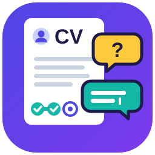

<p align="center">
  
</p>

<h1 align="center">Interview to CV</h1>

<p align="center">
  <strong>Answer a few questions. Get a CV for every country.</strong><br>
  An agent skill for Claude that interviews you and writes country-adapted CVs and cover letters.
</p>

<p align="center">
  <a href="https://github.com/richardpine189/interview-to-cv/releases/latest">Download</a> ·
  <a href="#install">Install</a> ·
  <a href="#how-to-use-it">How to use it</a> ·
  <a href="#markets">Markets</a> ·
  <a href="examples/alex-example">Example</a> ·
  <a href="docs/DESIGN.md">Design</a>
</p>

<p align="center">
  
  
  
</p>

---

Applying abroad means rewriting your CV for every country: a photo here but never there, one page or two, *Software Engineer* allowed in one place and a protected title in the next, your degree that nobody recognises. **Interview to CV** does that work with you:

1. **It interviews you** — one question at a time, always with a recommended answer you can accept with "ok". Bring your current CV and it only asks what's missing.
2. **It keeps one master profile** with everything about you, written once.
3. **It generates a CV per country**, applying that market's rules: what to include, what to leave out, language, spelling, length, section names.
4. **It translates your titles and degrees properly**, using official occupation and education classifications, with the source and date for each choice.

## What makes it different

- **Interview, not a form.** It never asks what it already knows.
- **Rules with sources.** Every market file lists the official pages it was built from and the date they were checked. Rules older than 6 months trigger a warning.
- **Real equivalences.** Job titles and degrees are mapped with ISCO-08, ISCED, O\*NET, NOC, SOC 2020, OSCA, ESCO, ROME and national classifications — 2–3 options, recommended first, you choose.
- **Credential recognition guidance.** Asks whether you have a formal assessment (WES ECA for Canada, ACS for Australia, UK ENIC, ENIC-NARIC France, FWB equivalence, LatAm convalidación…) and links you to the official process if you don't.
- **Protected titles handled.** It won't call you an *Engineer* in Canada or an *ingénieur* in Québec without the licence those titles require.
- **Cover letters that aren't generic.** Evidence slots instead of filler, a generic-phrase check, a "could this be sent to any company?" test, and a mandatory warning to review it twice.
- **Job matching.** Paste a posting: match score, gaps, strategy, tailored CV and letter. It never invents experience.
- **Your own templates.** Bring a company form or a design you like; it maps the fields and fills them.
- **Export your way.** Markdown, Word, PDF, ATS-safe, XeLaTeX (with Overleaf instructions) or a Europass sheet.

## Install

### Claude.ai (web and desktop apps)

1. Download **`interview-to-cv.zip`** from the [latest release](https://github.com/richardpine189/interview-to-cv/releases/latest).
2. Turn on **code execution and file creation** in Claude's settings (skills need it).
3. Go to **Customize → Skills**, click **+**, then **Upload a skill**, and choose the ZIP. Older versions of the app show this under **Settings → Capabilities**.
4. Start a new chat and say *"I want to build my CV for Canada"*.

Uploaded skills are private to your account.

### Claude Code and other agents

With the [`skills` CLI](https://github.com/vercel-labs/skills):

```bash
npx skills add richardpine189/interview-to-cv
```

Add `-g` to install it for every project.

Or install it by hand: copy `skills/interview-to-cv/` into `~/.claude/skills/` (all projects) or `.claude/skills/` (one project).

```bash
git clone https://github.com/richardpine189/interview-to-cv.git
```

```bash
cp -r interview-to-cv/skills/interview-to-cv ~/.claude/skills/
```

## How to use it

Talk to Claude in your own language; the CV comes out in the market's language. Some ways to start:

| You say | What happens |
|---|---|
| "Here's my CV. I want to apply in Canada and France." | Reads your CV, asks only what's missing, generates `ca-en` and `fr-fr` versions |
| "Quiero armar mi CV desde cero para trabajar en Australia." | Full interview in Spanish, CV in Australian English |
| "Here's a job posting — how well do I match?" | Match score, gaps, strategy, tailored CV and cover letter |
| "How does *Licenciado en Sistemas* translate in the UK?" | 2–3 options with SOC 2020 codes and sources |
| "I got the AWS certification." | Asks 2 questions, updates your profile, lists the CVs to regenerate |
| "Fill this application form with my data." | Maps the form's fields, asks for what's missing |
| "Export my Québec CV to PDF." | Text-based PDF, ATS-checked, named properly |

Your data lives in a `my-cv/` folder (Claude Code) or in a `master.md` file Claude hands back at the end of each session (Claude.ai — keep it and attach it next time).

See a full fictional run in [`examples/alex-example`](examples/alex-example): the [master profile](examples/alex-example/master.md) and the [Canadian CV](examples/alex-example/markets/ca-en/cv.md) generated from it.

## Markets

| Family | Market | Code | Credential recognition | Occupation source |
|---|---|---|---|---|
| North American resume | United States | `us-en` | NACES / AICE evaluators | O\*NET, SOC 2018 |
| | Canada (English) | `ca-en` | ECA (WES, CES, ICAS, IQAS, ICES) | NOC 2021 |
| | Québec (French) | `ca-fr` | MIFI comparative evaluation | CNP 2021 |
| Commonwealth CV | United Kingdom | `uk-en` | UK ENIC Statement of Comparability | SOC 2020 |
| | Australia | `au-en` | ACS skills assessment (ICT) | OSCA 2024, ANZSCO |
| French-European CV | France | `fr-fr` | ENIC-NARIC France attestation | ROME 4.0, ESCO |
| | Belgium (French) | `be-fr` | FWB equivalence (Equisup) | ESCO |
| Latin American CV | Latin America (Spanish) | `latam-es` | Convalidación / revalidación per country | SINCO, CUOC, CIUO-08 |

Every market file lists its sources and `last_verified` date. A GitHub Action opens a review issue every 6 months.

## How it works

```
master profile  ×  market filter  ×  job selection (optional)  ×  layout
```

```
skills/interview-to-cv/
├── SKILL.md              core flow: intake → interview → equivalences → generate
├── master/schema.md      the master profile format
├── markets/<code>.md     rules per country, with sources and dates
├── templates/<family>.md CV and cover letter layouts per family
├── references/           classifications and how equivalences are resolved
├── locales/en/           questions, messages, generic-phrase list
└── workflows/            job tailoring, cover letters, ATS, custom templates,
                          quick update, freshness review, export
```

The design decisions are recorded in [`docs/DESIGN.md`](docs/DESIGN.md).

## Your data stays yours

Your master profile contains personal data (immigration status, contact details, sometimes more). Keep your `my-cv/` folder private and **never** commit it to a public repository — this repo's `.gitignore` already blocks it. Everything in this repository is fictional.

Equivalences and credential guidance are information, not formal assessments or legal advice. Always check the official links before acting on them.

## Contributing

- **Found an outdated rule?** Open an issue with the official source. Every rule needs a primary source and a date.
- **New market?** Copy an existing `markets/<code>.md`, keep the same sections (Include, Omit, Transform, Constraints, Section names, Occupation sources, Credential recognition), cite official sources, set `last_verified`.
- **New interface language?** Translate `locales/en/` into `locales/<lang>/`.

Small commits with conventional messages (`feat:`, `docs:`, `chore:`), please.

## Roadmap

- LinkedIn profile per language, generated from the master profile
- Interview preparation (STAR stories) from your CV
- More markets: Germany, Brazil, Portugal…
- Interface translations: Spanish, French, German, Portuguese

## License

[MIT](LICENSE)
